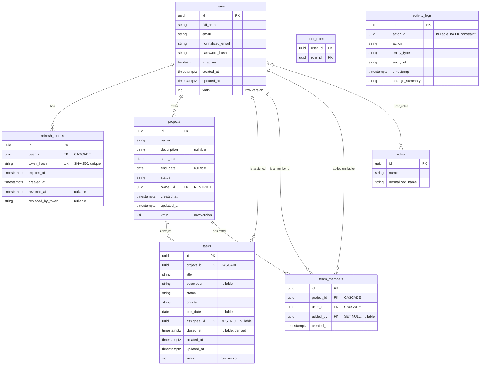

# Entity-Relationship Diagram

Generated from `src/ProjectManagementApp.Infrastructure/Persistence/Migrations/*_InitialCreate.cs`
(Constitution X.4). All five constitution entities are created here (research.md R-10) —
`projects`, `tasks`, and `team_members` are table-only in 001; their behavior is owned by
002/003/004 respectively.

## Notes

- **`xmin`** (PostgreSQL system column) is mapped as the optimistic-concurrency token on `users`,
  `projects`, and `tasks` — the three tables that are contended-updated (ADR-0004). `refresh_tokens`
  and `activity_logs` are append-only/system tables and deliberately excluded (shared-contracts.md §5).
  `team_members` has no mutable field, so there is nothing for a row version to protect — its
  correctness guarantee is the unique index `(project_id, user_id)` instead (added by 004).
- **`activity_logs.actor_id`** has no foreign-key constraint — audit rows must survive the deletion
  of the actor that created them.
- The four unused ASP.NET Core Identity tables (`user_claims`, `user_logins`, `user_tokens`,
  `role_claims`) are created by Identity's stores and are intentionally empty in this application
  (data-model.md §6).
